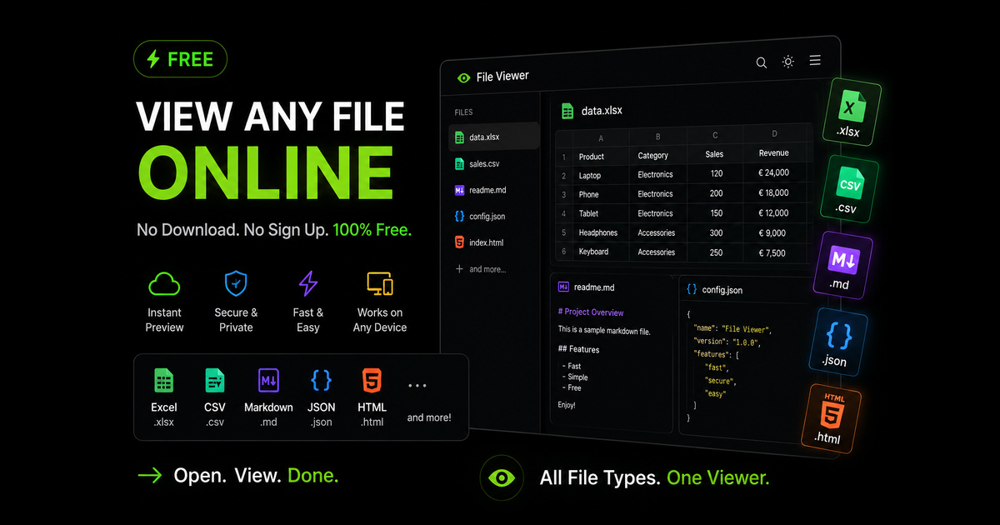

# Online File Viewer

> Open Excel, CSV, JSON, YAML, Markdown and HTML files in your browser

**[Open the tool → online-file-viewer.github.io](https://online-file-viewer.github.io/)**

Online File Viewer is a free, browser-based viewer for the files you most often need to read but not edit: Excel spreadsheets, CSV, JSON, YAML, Markdown and HTML. Paste your text or drop a file and it detects the format automatically — spreadsheets become a sortable table, JSON becomes a collapsible tree you can format or minify, Markdown renders as formatted text, and HTML previews safely in a sandbox. Everything runs locally in your browser, so nothing is uploaded to a server and the tool keeps working offline.

## Why it is different

- **Nothing is uploaded.** Every file is read and rendered in your own browser — no server ever sees it, so it is safe for confidential exports and client data.
- **No sign-up, no ads, no tracking.** No analytics, no cookies, no third-party requests at all.
- **Works offline.** Once the page has loaded, it keeps working with no connection.
- **Fast by design.** One self-contained page; the heavy engines load only when a document actually needs them.

## Features

- **CSV viewer** — read spreadsheets without a spreadsheet
- **JSON viewer** — a readable, collapsible tree
- **Markdown viewer with live preview**
- **Mermaid diagrams, LaTeX math and syntax highlighting**
- **Rich HTML inside Markdown**
- **JSON formatter** — beautify or minify in one click
- **HTML viewer with a safe sandboxed preview**
- **Excel viewer** — open .xlsx without Excel
- **Column statistics and smart tables**
- **YAML viewer and validator**
- **Search, filter and share**
- **Private by design** — nothing is uploaded

## How to use

1. Paste your text into the box, or drop a file anywhere on the page (you can also click Open file).
2. The format is detected automatically — CSV, JSON, YAML, Markdown or HTML — and the preview appears instantly.
3. Use the Auto / Markdown / CSV / JSON / HTML / YAML buttons if you want to force a specific format.
4. Sort CSV columns, filter rows, search JSON keys, format or sort JSON and YAML — then copy, download, or share the document as a link.

## Who it is for

- **Developers** — inspect an API response or a config file without leaving the browser.
- **Analysts** — peek at a CSV export before importing it into a spreadsheet or database.
- **Writers & documentation authors** — preview a README or Markdown draft exactly as it will render.
- **Support & ops teams** — open a log dump or data export on a machine with nothing installed.
- **Anyone on a locked-down or borrowed computer** — read a file with no software to install and no account to create.

## How it works

The whole tool is a single self-contained HTML page: the CSS and JavaScript are inlined, the fonts are the system stack, and there are no third-party requests. Larger engines — the spreadsheet reader, the diagram and formula renderers — are vendored into `lib/` and fetched only the first time a document needs one, so a normal visit never pays for them.

A service worker caches the page so it keeps working offline. Shared links carry the document compressed in the URL *fragment*, which browsers never send to a server — sharing does not break the privacy story.

> Note: `index.html` is the built, minified page. It is generated, so please open an issue rather than sending a patch against the minified file.

## FAQ

Is this online file viewer free?
 Yes — completely free, with no sign-up, no account and no limit on how many files you open.

Are my files uploaded to a server?
 No. Files are read and rendered entirely inside your browser. Nothing is uploaded, stored or logged, and there is no tracking or analytics code on the page.

Which file formats can I view?
 Excel workbooks (.xlsx, .xls, .ods), CSV and TSV, JSON and JSONL, YAML, Markdown (.md) and HTML. Plain text files also work — they are shown as Markdown.

How does the automatic format detection work?
 It reads the structure of your text. A leading bracket or brace means JSON; headings, lists or code fences mean Markdown; consistent comma, semicolon or tab separated rows mean CSV; mostly key: value lines mean YAML; and a document made largely of tags is treated as HTML, even when it has no doctype. You can always override it with the Auto, Markdown, CSV, JSON, HTML and YAML buttons.

Can I sort a CSV file?
 Yes. Click any column header to sort by that column, and click it again to reverse the order. Numeric columns sort as numbers rather than as text.

What happens if my JSON is invalid?
 You get the parser error message and the line number where it failed, so you can find the missing comma, quote or bracket quickly.

How large a file can I open?
 Files up to 10 MB can be opened, and anything up to a few megabytes feels instant. Because everything runs in your browser, the practical ceiling depends on your device rather than on a server limit; very wide tables are capped at 2,000 displayed rows so the page stays responsive.

Does it work offline and on mobile?
 Yes. It works on phones, tablets and desktops, and once the page has loaded once it keeps working with no internet connection.

## Contributing

Bug reports and feature requests are welcome — please open an issue. If a file of yours renders incorrectly, a small sample that reproduces it is the most useful thing you can attach.

## Licence

MIT — see [LICENSE](LICENSE).

Built by Kim Ngan Bui.
